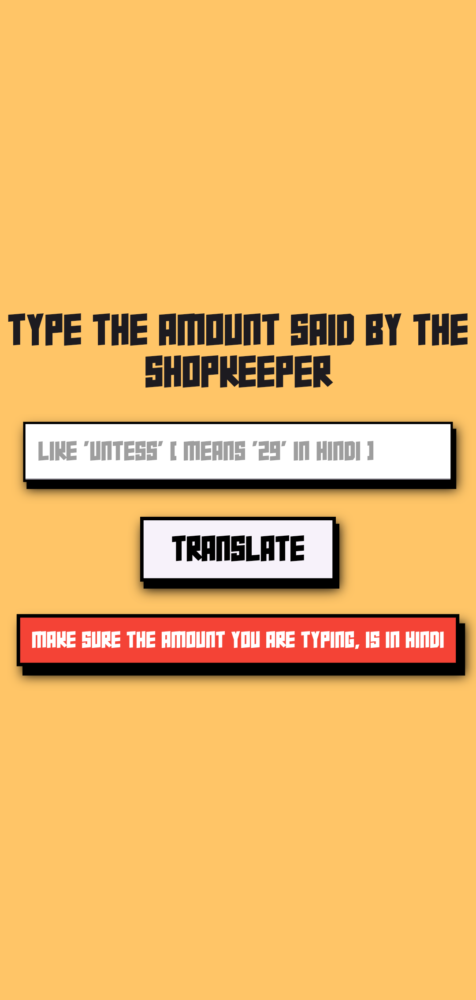
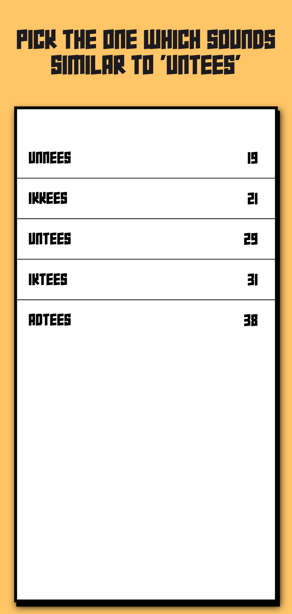

# Kitna

A Flutter app that helps users understand number amounts they hear from shopkeepers. It converts Hindi number words (e.g., "adtees" → 38) into English numerals, helping users quickly understand Hindi numbers they may hear from local shopkeepers in India.

## 📱 Screenshots

## 🎥 Demo

## ✨ Features

- 🔢 Convert spoken/typed number words into numbers
- 🔍 Find possible matching number words
- 🇮🇳 Supports Indian number words
- 📱 Built with Flutter

## 🛠️ Tech Stack

- Flutter
- Dart
- Node.js
- Express.js

